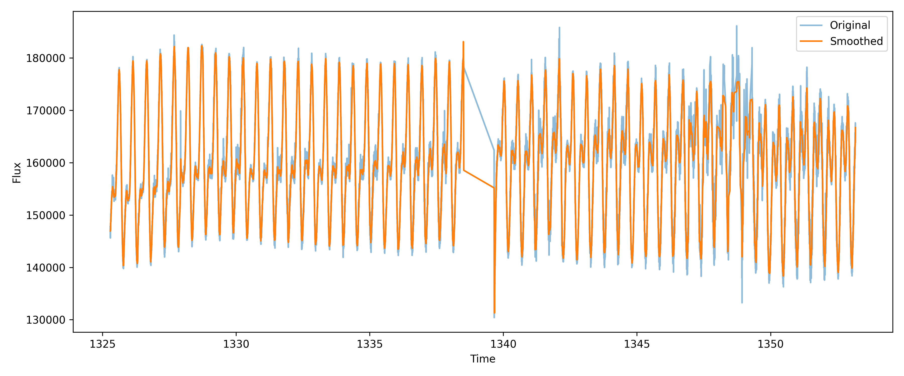

# Light Curve Denoiser

Astronomy project for smoothing and denoising stellar light curves using Python and signal processing methods.

## Features

- Load TESS light curves
- Apply Savitzky–Golay smoothing
- Compare noisy and denoised signals
- Visualize results
- Save output images

## Dataset

Mission: **TESS**

Target:

**AB Dor**

## Output Preview

## Methods

Savitzky–Golay filtering

## Tools

- Python
- SciPy
- NumPy
- Matplotlib
- Lightkurve
